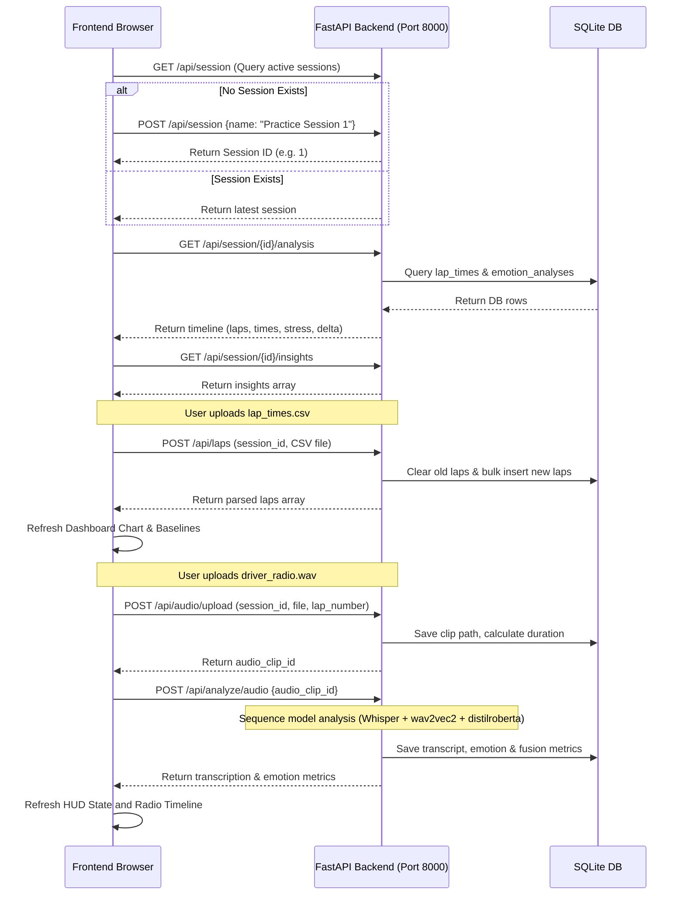

# PitPulse Frontend Screen Design (Phase 4)

This document details the implementation design for the first two UI screens of PitPulse: the **Race Overview / Dashboard** and the **Radio Analyzer**. Both screens are designed with an authentic, high-density F1 broadcast graphics aesthetic and connect directly to the real backend.

---

## 1. Design System & Theme Configuration
We will use Tailwind CSS v4 to configure our custom tokens, fonts, and dark mode colors.

### Design Tokens
* **Backgrounds**:
  * Main Application: OLED Black (`#000000`)
  * Card Backgrounds: Dark Carbon Grey (`#0b0c10` with high contrast dark gray borders `#1f2937`)
* **Accents**:
  * Primary Accent: F1 Racing Red (`#E10600`)
  * Secondary Accent: Dark Slate / Silver (`#8D9091`)
* **Driver Status Indications**:
  * `CALM`: Neon Emerald (`#00F294`)
  * `STRESSED`: Neon Rose/Red (`#FF2D55`)
  * `TIRED`: Neon Amber/Orange (`#FF9500`)
* **Typography**:
  * Standard text: Geometric sans-serif (`Geist` / `Outfit` / `Inter`)
  * Telemetry numbers & JSON codes: High-readability monospace (`Geist Mono` / `SFMono-Regular`)

---

## 2. Page & Component Structure

### Navigation Layout (`frontend/app/layout.tsx`)
A unified container wrapping all screens:
* **Timer/Latency Banner**: Horizontal top bar with live connection status to `localhost:8000`, a flashing green heartbeat indicator, and the active session name.
* **F1 HUD Header**: Left-aligned "PITPULSE" logo in italicised uppercase, middle-aligned driver indicator (`L. HAMILTON // CAR 44`), and right-aligned navigation tabs.
* **Side-by-side tabs**: Links to `/dashboard` and `/radio-analyzer`.

### Dashboard (`frontend/app/dashboard/page.tsx`)
A high-density telemetry screen divided into three columns:
1. **Driver HUD Card**:
   - Current driver state badge (big, pulsing box colored according to the state).
   - Horizontal progress bars showing:
     - Combined Stress (0-100%)
     - Fatigue level (0-100%)
     - Voice Urgency (0-100%)
     - Transcription Confidence (0-100%)
2. **Lap Telemetry & Performance Card**:
   - Monospace list of lap times.
   - Large highlight boxes for:
     - Current Lap Number & Lap Time.
     - Baseline Average (calm laps preceding stress event).
     - Performance Delta (red `+X.XXs` degradation, green `-X.XXs` improvement).
   - Telemetry Ingest Form: Button to upload a `lap_times.csv` to `POST /api/laps` for the current session.
3. **Correlation Graph (Recharts)**:
   - Line chart charting Lap Number (X) vs. Lap Time (Left Y-Axis, line) and Stress Score (Right Y-Axis, filled area).
   - Visually indicates the exact lap where stress increases and lap times deteriorate.

### Radio Analyzer (`frontend/app/radio-analyzer/page.tsx`)
A tool to upload and examine radio clips:
1. **Audio Upload Box**:
   - Drag-and-drop or click-to-select wav/mp3 file uploader.
   - Associated Lap Number input field (to link the clip to a specific telemetry lap).
   - "TRANSMIT PACKET" button.
2. **Analysis Progress Terminal**:
   - Displays real-time loading steps while the models process CPU-bound audio classification:
     - `[01/03] Transmitting audio packet... OK`
     - `[02/03] Whisper ASR processing speech...`
     - `[03/03] Emotion Fusion running...`
3. **Multimodal Analysis Board**:
   - Displays Whisper transcript in bold monospace text.
   - Shows text emotion classification vs. speech acoustic emotion classification.
   - Displays urgency, fatigue, and final state.
4. **Historical Audio Timeline**:
   - Historical feed of all audio clips uploaded for the current session. Clicking any past clip instantly re-loads its analysis metrics and transcript in the main board.

---

## 3. Data Flow & Backend Integration



---

## 4. Error Handling Spec
1. **Model Timeout / Failure**:
   - If `POST /api/analyze/audio` returns an HTTP 500 or times out, display a warning banner: `[TELEMETRY FAILURE] STT / Emotion Pipeline Timeout. Check model initialization on server.`
2. **Upload Failure**:
   - If audio upload or CSV upload fails (e.g. wrong format, network drop), catch the response error message and show a red error notification bar.
3. **Session Synchronization**:
   - Keep a polling or retry mechanism to check backend availability, displaying `OFFLINE` or `ONLINE` in the HUD header.

---

## 5. Verification Plan

### Automated Build & Lint Check
Run next build to ensure TypeScript types and React components build cleanly:
```bash
npm run build
```

### Manual E2E Flow
1. Verify backend server is running on `http://localhost:8000`.
2. Load UI dashboard page. It should automatically synchronize session or create Session ID 1.
3. Upload `demo-assets/lap_times.csv`. Confirm that the Recharts line graph plots all 22 laps.
4. Open the Radio Analyzer tab.
5. Ingest the demo audio file `/demo-assets/screaming_pit_entry.wav` (associated with Lap 18).
6. Verify transcription says something like *"Box box box, tires are gone"* and state transitions to `STRESSED`.
7. Verify dashboard updates to display the new driver state, stress bars, and baseline performance delta.
